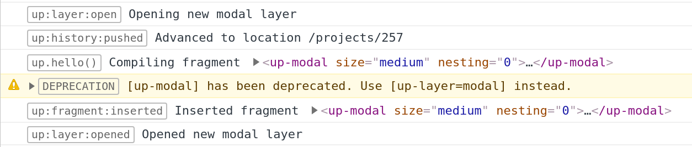
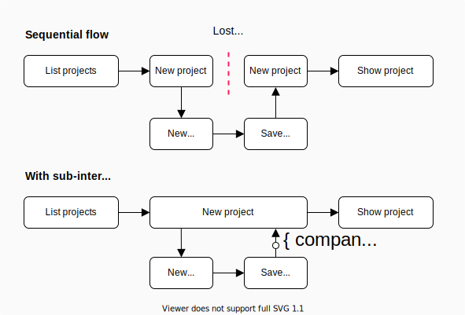
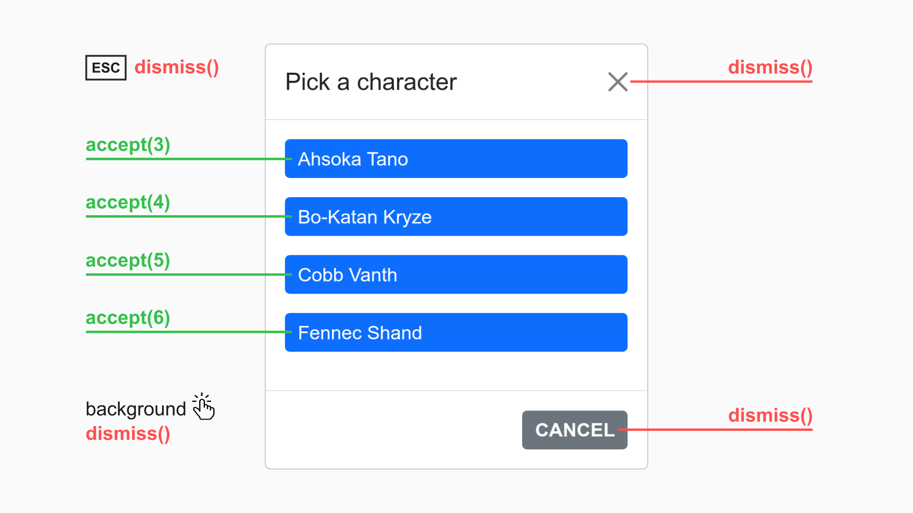
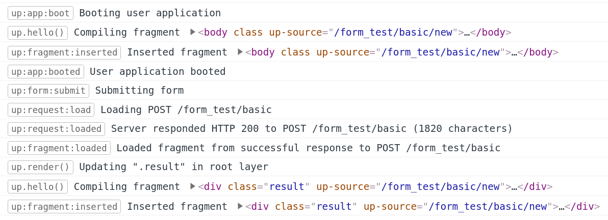

<!-- _class: no-watermark -->

<div class="title">
  
  <div class="title--author">
    Henning Koch&nbsp; <a href="https://twitter.com/triskweline">@triskweline</a>
  </div>  
</div>


---

# About Unpoly

[Unpoly](https://unpoly.com) is an unobtrusive JavaScript framework for server-side web applications.\
It enables fast and flexible frontends while keeping rendering logic on the server.

**This presentation is for experienced Unpoly 1 users\
who want to learn about the major changes in Unpoly 2.**


---


Roadmap
=======

There will be two major Unpoly releases in **December 2020 / January 2021**:

- The current version 0.62 will be published as **Unpoly 1.0**.
- **Unpoly 2.0** will be released as a major upgrade.

----

Unpoly 2?
=========

Unpoly 2 is the end of a long-term project.

It resulted from many discussions with my colleagues at makandra, 
and the limits they ran into when using Unpoly for non-trivial interactions.

I also looked through a lot of code on our Gitlab to see how Unpoly was used in the wild.

<!--

| Date    | Event              |
| ------- | ------------------ |
| 2018-02 | Start branch       |
| 2019-01 | `git reset --hard` |
| 2020-12 | Today              |
| 2021-01 | Release Unpoly 2   |

-->


----

Unpoly 2 objectives
===================

<!--
- Kill boilerplate configuration
- Layer rewrite
- Sub-interactions
- Navigation intent
- Accessibility
- Quality of live improvements
-->

<div class="row">
<div class="col">

### Kill boilerplate configuration

Repetitive configuration code is now the default.
New, unopionated Bootstrap integration.

### Layer API

A new layer API replaces modals and popups.\
Layers are isolated and can be stacked infinitly.

### Sub-interactions

Branch off sub-interaction into an overlay.\
Overlay results are propagated back to parent layer, where the story continues.
</div>
<div class="col">

### Navigation intent

Not every fragment update means a user navigation.
Switching screens need other defaults than updating a box.

### Accessibility

All Unpoly features carefully manage focus.
Keyboard navigation is supported everywhere.

### Quality of live improvements

Extensive improvements for almost all APIs.
</div>
</div>

---
<!-- _class: pro -->

Some slides have a **PRO** marker in the top left corner.

These are advanced topics.

We will cover these in our next session in January.

---


<!--

<div class="columns">

Kill boilerplate configuration
------------------------------
- Configure default targets.
- Handle all links/forms without helpers and macros.
- Minimal Bootstrap integration you actually want to use.

New layers
----------
- A new *layer* API replaces modals and popups. The root page is also a layer.
- Layers are now isolated. They cannot accidentally target another layer, or accidentally react to events from other layers.
- Layers may be stacked infinitely.
- Customize layers with fixed sizes, classes, custom dismissability.
- New full-screen overlay mode `cover`.

Sub-interactions
----------------
- Complex interactions may be paused by branching off a sub-interaction into an overlay.
- When opening an overlay you may define a *condition* when the sub-interaction ends.
- Overlay results (selection, finished record creation) are propagated back to parent layer.
- JavaScript may treat overlays as an async operation with a result value.

Navigation intent
------------------
- Not every fragment update means a user navigation (switching screens vs. updating a small fragment).
- Only user navigation scrolls, focuses, falls back to default targets.
- User navigation now aborts earlier requests.

Accessibility
-------------
- New `{ focus }` option lets you control focus after a fragment update.
- Overlays are accessible by trapping focus and removing other layers from the accessibility tree.
- Focus, selection, scroll positions within updated fragments are now preserved.
- Support keyboard navigations for all interactive elements.

Quality of live improvements
----------------------------
- Unified fragment update API.
- Server can emit emits, close overlays, clear the cache, ...
- Event handler may change render options.
- Calmer scrolling.
- Polling.
- New `:closest` selector for targeting self-contained components.
- Preloading eats less bandwidth and server resources

</div>

----
--->

Changes ahead, but don't panic!
===============================

I know that many of you are maintaining large apps with Unpoly 0.62.

You will see some major changes in these slides, but **don't panic**!\
Unpoly 2 keeps aliases for deprecated APIs going back to 2016.

---


<p>Calls to old APIs will be forwarded to the new version and log a deprecation notice with a trace.
</p>



<p>This way you upgrade Unpoly, revive your application with few changes,<br>
then replace deprecated API calls under green tests.</p>

---

<div class="row">
<div class="col">

### Renamed events are aliased

`up.on('up:proxy:load')` will bind to\
`up:request:load`.

### Renamed functions are aliased

`up.modal.close()` will call\
`up.layer.dismiss()`

### Renamed options are aliased

`{ reveal: false }` will be renamed to\
`{ scroll: false }`

</div>
<div class="col">

### Renamed packages are aliased

`up.proxy.config` will return\
`up.network.config`.

### Renamed HTML attributes are aliased

`<a up-close>` will translate to\
`<a up-dismiss>`.
</div>

---


<!-- _class: topic -->

# Kill boilerplate configuration

---

**💡 Our projects need too much code to configure Unpoly.**

None of our projects use Unpoly as it comes out of the box.
Instead we customize Unpoly with a long list of custom settings, Rails helpers
and macros that we copy from project to project.

Some of that should be a better default by the framework.

---

Delete your link helpers
========================

All our projects have helpers like `content_link` and `modal_link` to configure defaults:

- Make a link followable through Unpoly
- Accelerate clicks with `[up-preload]` and `[up-instant]`
- Set a default target selector
- Set a transition (sometimes)

**In Unpoly 2 these helpers (and their macros) are no longer needed.**

You can configure Unpoly 2 to handle standard `<a href>` links without any `[up-...]` attributes.

Rails users can now use the standard `link_to` helper without extra options.


---

Following all links by default
==============================

**💡 Most apps handle all links and forms through Unpoly.**

Unpoly 1 forced apps to manually opt-in every link and form.

You can tell Unpoly 2 to handle **all** links and forms:

```js
up.link.config.followSelectors.push('a[href]')
up.form.config.submitSelectors.push('form')
```

Links will now be followed through Unpoly **without** an `[up-target]` or `[up-follow]` attribute:

```html
<a href="/backend">...</a>
```

----

## Making exceptions


You may still opt out individual links or forms by setting `[up-follow=false]`:

```html
<a href="/backend" up-follow="false">...</a>
```

To except *all* external links and forms, skip URL with a schema separator (`://`):

```js
up.link.config.followSelectors.push('a[href]:not([href*="://"])')
up.form.config.submitSelectors.push('form:not([action*="://"])')
```

---

Accelerating links by default
==============================

**💡 Most links should activate on `mousedown`  and be preloaded.**

If you want to default to `[up-instant]` and `[up-preload]`:

```js
up.link.config.instantSelectors.push('a[href]')
up.link.config.preloadSelectors.push('a[href]')
```

All your links now activate on `mousedown` and (with a `GET` method) preload on `mouseover`:

```html
<a href="/backend">...</a>
```

---

## Making exceptions

Instant clicks feel wrong for buttons. To cover that, configure a CSS selector that excludes buttons:

```js
up.link.config.instant.push('a[href]:not(.button)')
```

Individual links may opt out by setting `[up-instant=false]` or `[up-preload=false]`:

```html
<a href="/backend" up-instant="false">
<a href="/expensive-path" up-preload="false">
```

---

Main targets
============

**💡 Many links simply replace the main content element.**

Unpoly 1 required you to pass a target selector with every fragment update, although it would often be the same selector.

Unpoly 2 lets you mark elements as default targets using the `[up-main]` attribute:

```html
<body>
  <div class="layout">
    <div class="layout--side">
      ...
    </div>
    <div class="layout--content" up-main>
      ...
    </div>
  </div>
</body>
```

---

## Links work without target

Once a main target is configured, you no longer need `[up-target]` in a link.\
Use `[up-follow]` and the `[up-main]` element will be replaced:

```html
<a href="/foo" up-follow>...</a>
```

If you want to update something more specific, you can still use `[up-target]`:

```html
<a href="/foo" up-target=".profile">...</a>
```

Instead of assigning `[up-main]` you may also configure an existing selector:

```js
up.fragment.config.mainTargets.push('.layout--content')
```

---

Overlays can use different main targets
---------------------------------------

**💡 Overlays often use a different default selector, e.g. to exclude a navigation bar.**

Unpoly 2 lets you configure different main targets for different layer modes:

```html
<body>
  <div class="layout" up-main="root">
    <div class="layout--side">
      ...
    </div>
    <div class="layout--content" up-main="overlay">
      ...
    </div>
  </div>
</body>
```

You may also configure overlay targets unobtrusively:

```js
up.layer.config.popup.targets.push('.menu')              // for popup overlays
up.layer.config.drawer.targets.push('.menu')             // for drawer overlays
up.layer.config.overlay.targets.push('.layout--content') // for all overlay modes
```

---

<!-- _class: pro -->


Setting a default transition
============================

I'm not a big fan of animating *every* fragment update.

**But since some of you do this**, here is how to set a default transition:

```js
up.fragment.config.navigateOptions.transition = 'cross-fade'
```

We're going to learn more about `up.fragment.config.navigateOptions` in a minute.


---
<!-- _class: pro -->

Reworked Boostrap integration
=============================


**💡 Many projects didn't use built-in Bootstrap integration, because it was too opinionated.**

For example, Unpoly tried to re-use the Bootstrap modal styles, but most projects simply wanted the white box from the Unpoly default. Projects ended up using their own configuration, which was much more minimal.

Unpoly 2 now ships with a **unopinionated Bootstrap integration**.

---
<!-- _class: pro -->

This is all of `unpoly-boostrap4.js`:

```js
// Bootstrap expects the class .active instead of .up-active
up.feedback.config.currentClasses.push('active')

// Set .up-current classes in Bootstrap navigation components
up.feedback.config.navs.push('.nav', '.navbar')

// When validating, update the closest form group with the results
up.form.config.validateTargets.unshift('.form-group:has(&)')

// When revealing, scroll far enough so content is not covered by
// fixed Bootstrap bars
up.viewport.config.fixedTop.push('.navbar.fixed-top')
up.viewport.config.fixedBottom.push('.navbar.fixed-bottom')
up.viewport.config.anchoredRight.push('.navbar.fixed-top', '.navbar.fixed-bottom')

/// Don't use common utility classes to build selectors
up.fragment.config.badTargetClasses.push(
  'row',
  /^col(-xs|-sm|-md|-lg|-xl)?(-\d+)?$/,
  /^[mp][tblrxy]?-\d+$/
)
```

---
<!-- _class: pro -->

This is all of `unpoly-bootstrap4.scss`:

```css
up-modal, up-drawer, up-popup {
  .container, .container-fluid {
    padding-left: 0;  /* The overlay box already has padding */
    padding-right: 0; /* The overlay box already has padding */
    max-width: none;  /* The overlay box already has max-width */
  }
}
```

----
<!-- _class: pro -->

## Support for Bootstrap 3, 4 and 5

Unpoly 2 now supports the three major Bootstrap versions we're using:

- `unpoly-bootstrap3.js`
- `unpoly-bootstrap3.css`
- `unpoly-bootstrap4.js`
- `unpoly-bootstrap4.css`
- `unpoly-bootstrap5.js`
- `unpoly-bootstrap5.css`


---
<!-- _class: 'topic' -->

# Layer API

---

# Demo

🎥 *Show infinite stacking: Company / Project / Budget*

🎥 *Show returning with value: Create budget from project details*

---


New layer terminology
======================

The root page, modals and popups have been consolidated into a single term *layer*.

There are different layer *modes*, e.g. `modal` or `popup`.

An *overlay* is any layer that is not the root layer.

<br>


| Mode      | Description                        | Overlay? |
| --------- | ---------------------------------- | -------- |
| `root`    | The root page                      | no       |
| `modal`   | A modal dialog box                 | yes      |
| `drawer`  | A drawer sliding in from the side  | yes      |
| `popup`   | A popup menu anchored to a link    | yes      |
| `cover` ✨  | Covers entire screen               | yes      |


---

<!--

# A single attribute for depth changes

You can always look at `[up-layer]` to know what layer is going to be updated.

If there is no `[up-layer]` attribute, you are going to update the current layer.


## Deprecation of old macros

`[up-modal]` is deprecated. Use `[up-layer=modal]` or `[up-layer=new]` instead.\
You can configure the mode for `[up-layer=new]` in `up.layer.config.mode`.

`[up-popup]` is deprecated. Use `[up-layer=popup]` instead.

-->


Layers can be stacked infinitely
================================

**💡 In Unpoly 1 you could only open a single modal.
This limited its practical applications.**

Example from a real application:

- An index page on the root layer shows a list of records
- Clicking a record opens a record in a modal overlay. This is useful since the user retains the scroll position of the list in the background.
- The details screen cannot open another modal overlay, since one is already open.

**Unpoly 2 lets you stack an arbitrary number of layers.**

🎥 *Show demo*


---

Layers are fully isolated
=========================

**💡 In Unpoly 1 you could accidentally update another layer.**

In Unpoly 2 layers are fully isolated. You cannot accidentally target an element in another layer:

```html
<a href="/path" up-target=".foo"> <!-- will only match in current layer -->
```

If you want to do *anything* in another layer, use an `[up-layer]` attribute:

```html
<a href="/path" up-target=".foo" up-layer="parent"> <!-- will only match in parent layer -->
<a href="/path" up-target=".foo" up-layer="root">   <!-- will only match in root layer -->
<a href="/path" up-target=".foo" up-layer="new">    <!-- opens a new modal overlay -->
```

You can always look at `[up-layer]` to know what layer is going to be updated.\
If there is no `[up-layer]` attribute, you are going to update the current layer.


----

# CSS selectors are matched in the current layer

JavaScript functions that take a **CSS selector** will only look in the current layer:

```js
up.submit('.user-form') // will only find in the current layer
up.fragment.get('.foo') // will only find in the current layer
```

If you want to match a selector in another layer, use a `{ layer }` option:

```js
up.fragment.get('.first', { layer: 'any' })    // will find in any layer
up.fragment.get('.first', { layer: 'parent' }) // will find in parent layer
```

You don't need a `{ layer }` option when you pass DOM elements instead of selectors:

```js
up.submit(form) // will submit the form in the form's layer
up.fragment.get(element, '.child') // will find .child in element's descendants
```

---
<!-- _class: pro no-watermark -->

<h2 class="center">Referring to layers</h2>

<div class="row">
<div class="col">

| Layer name           | Description                                                  |
| ---------------- | ------------------------------------------------------------ |
| `current`        | The current layer                                            |
| `any`            | Any layer, preferring the current                     |
| `parent`         | The layer that opened the current layer                      |
| `closest`        | The current layer or any ancestor, preferring closer layers  |
| `root`           | The root layer                                               |
| `overlay`        | Any overlay                                                  |
| `origin`         | The layer of the element that triggered the current action   |
| `<Number>`         | The layer with this index                                    |

</div>
<div class="col">

| Layer name       | Description                                                  |
| ---------------- | ------------------------------------------------------------ |
| `ancestor`       | Any ancestor layer of the current layer                      |
| `child`          | The child layer of the current layer                         |
| `descendant`     | Any descendant of the current layer                          |
| `<Element>`        | The given element's layer                                    |
| `current root`   | Space-separated alternatives                                 |
| `front`          | The frontmost layer (which may not be the current layer)   |

</div>
</div>


<!--
When updating fragments you have two additional options:

| Value  | Description                              |
| ------ | ---------------------------------------- |
| `swap` | Replace the front layer with a new layer |
| `new`  | Open a new layer                         |
-->

---

Most events are associated with a layer
=======================================

**💡 Layers are rarely interested in events of other layers.**

Where possible Unpoly 2 will emit its events on associated layers instead of `document`.\
This way you can listen to events on one layer without receiving events from other layers.

Events resulting from user navigation (like `up:link:follow`, `up:request:load`) are associated with the layer of the activated element.

---


## Listening to your layer

Unpoly 2 provides convenience functions `up.layer.on()`  and `up.layer.emit()`\
to listen / emit on the current layer:

```js
up.layer.on('up:request:load', callback) // only listen to events from the current layer
up.layer.emit('my:event') // emit my:event on the current layer's element
```

The current layer is the layer in which you are compiling or navigating.


## Listening to everything

Layer events will still bubble up to the `document`,\
so you can still register
a listener for events from any layer:

```js
up.on('up:request:load', callback) // listen to events from all layers
```


---
<!-- _class: pro -->

Inspecting the layer from the server
====================================

The server now knows if the request is targeting an overlay:

```ruby
up.layer.mode      # 'drawer'
up.layer.overlay?  # true
up.layer.root?     # false
```

Note that fragment updates may target different layers for successful (HTTP status `200 OK`) and failed (status `4xx` or `5xx`) responses. Use `up.fail_target` to learn about the
layer targeted for a failed update:

```ruby
up.fail_layer.mode      # 'root'
up.fail_layer.overlay?  # false
up.fail_layer.root?     # true
```


---

<!-- { _class: 'topic' } -->

# Sub-interactions

---

Why we need sub-interactions
============================

🎥 *Show scenario in the demo app*

This story is the base use case for a sub-interaction:

- User starts filling out the form for a new project
- To create a project, the user must select a company. But the desired company does not yet exist.
- The user may open a new overlay to create the missing company.\
  The unfinished project form remains open in the background.
- When the company was created in the overlay, the overlay should close.\
  The project form should now have the newly created company selected.

----

<!-- _class: no-watermark no-padding -->



----

# Unpoly 1 modals didn't work well for this

**💡 Unpoly 1 hade no way to communicate the "result" of an overlay back to the parent layer.**

Overlay content needed to update fragments in the parent layer to continue the story there.
This required the overlay to know the parent layer's state, *coupling* the sub-interaction to the parent interaction.

In Unpoly 2 overlays no longer need to know about the parent layer's state.


---

# Acceptance conditions in Unpoly 2

**When opening an overlay in Unpoly 2, you may define a *condition* when the overlay interaction ends.**

When the condition occurs, the overlay is automatically closed and a callback is run.


This completely *decouples* the outer interaction from sub-interactions.

---


Overlay result values
====================

Overlays in Unpoly 2 may have a *result value*.

E.g. if the user selects a value, creates a record or confirms an action,
we consider the overlay to be **accepted with that value**.

```js
up.layer.open({
  url: '/select-user',
  onAccepted: (event) => console.log('Got user ', event.value)
})
```

The following slides examine how an overlay can be *accepted*.

---

Accepting when a location is reached
====================================

The following will open an overlay that closes once a URL like `/companies/123` is reached:

```html
<a href="/companies/new"
  up-layer="new"
  up-accept-location="/companies/$id"
  up-on-accepted="alert('New company with ID ' + value.id)">
  New company
</a>
```

Placeholders in the URL pattern (`$id`) become the overlay's *acceptance value*.

The `[up-on-accepted]` callback is called with an acceptance value.

---

## Reloading on acceptance

A **common callback** is to reload an element in the parent layer:

```html
<a href="/companies/new"
  up-layer="new"
  up-accept-location="/companies/$id"
  up-on-accepted="up.reload('.company-list')">
  New company
</a>

<div class="company-list">
  ...
</div>
```

---

## Adding options to an existing select

Another common callback reloads `<select>` options and selects the new foreign key:

```html
<select name="company">...</select>

<a href="/companies/new"
  up-layer="new"
  up-accept-location="/companies/$id"
  up-on-accepted="up.validate('select', { params: { company: value.id } })">
  New company
</a>
```

---

## Why this is useful

- You already have a CRUD interaction for companies
- You can now embed the existing company form into your project form
- **The embedded interaction does not need to know when it's "done" or
  what to do when it's done.** Instead the parent layer defines an
  acceptance condition and callback action.


---

Accepting when an event is emitted
==================================

Instead of waiting for a location to be reached,
you may accept an overlay\
once a given **event** is observed on the overlay:

```html
<a href="/users/new"
  up-layer="new"
  up-accept-event="user:created"
  up-on-accepted="alert('Hello user #' + value.id)">
  Add a user
</a>
```

The event object becomes the overlay's acceptance value.


---

## Emitting events from your frontend

Unpoly uses standard DOM events that you can emit with `Element#dispatchEvent()` or `up.emit()`.

To emit an event on the current layer, your JavaScript code may use `up.layer.emit()`:

```js
up.layer.emit('user:created', { id: 123 })
```

### Emitting when a link is clicked

To emit an event when the user clicks on a link, you may also use `[up-emit]` in your HTML:

```html
<a href='/users/5'
  up-emit='user:selected'
  up-emit-props='{ "id": 5 }'>
  Select user #5
</a>
```
A parent layer waiting for this event will prevent it, causing the link not to be followed.


---

## Emitting events from the server

In a server-side application, events often occur on the server.

**In Unpoly 2 the server can also emit events:**

```ruby
class UsersController < ApplicationController
  ...

  def create
    build_user
    if @user.save
      up.layer.emit('user:created', id: @user.id)
      redirect_to @user
    end
  end

end
```

The server-sent event is emitted on the updated layer.\
To emit on the `document`, use `up.emit()` instead.

---

Accepting a layer explictly
===========================

If you want to be *really direct*, assign an `[up-accept]` attribute to a link in an overlay.\
The link's layer will be closed when the link is clicked:

```html
<a href='/users/5' up-accept='{ "id": 5 }'>Choose user #5</a>
```

The JSON value of the `[up-accept]` attribute becomes the overlay's acceptance value.

The link's `[href]` is just a fallback here. It will only be followed if the link is on the root layer (where there is no overlay to accept). You can also omit the `[href]` attribute.

<br>

**I'm not a huge fan of this** because it couples the overlay interaction to its parent layer.\
But some of you asked for it, and I guess sometimes the overlay cannot be decoupled
from its parent.

---

## Accepting from the server

The server can also accept an overlay explicitly:

```ruby
class UsersController < ApplicationController

  def create
    build_user
    if @user.save
      if up.overlay?
        up.layer.accept(id: @user.id)
        up.render_nothing
      else
        redirect_to @user
      end
    end
  end

  ...
end
```

---


Positive vs. negative close intent
==================================

We've seen examples where an overlay was accepted with a result value.\
But what happens if the user presses `ESC` or clicks the "X" button?

For this Unpoly 2 distinguishes two kinds close intents:

1. <span class="positive">**Accepting**</span> a layer (user picks a value, confirms with "OK", etc.), optionally with a value
2. <span class="negative">**Dismissing**</span> a layer (user clicks "Cancel", "X", presses `ESC`, clicks on the background)


---

<!-- _class: no-watermark -->



---


<h2>
  <span class="positive">Acceptance</span> means next step<br>
  <span class="negative">Dismissal</span> means cancelation
</h2>  

When you're waiting for a sub-interaction to finish successfully,
you're probably only interested in layer acceptance, but not dismissal. 

When opening a layer you may pass separate `{ onAccepted }` and `{ onDismissed }`  callbacks:

```js
up.layer.open({
  url: '/users/new',
  onAccepted: (event) => console.log("New user is " + event.value),
  onDismissed: (event) => console.log("User creation was canceled")
})
```

---
<!-- _class: pro -->

Overlays are promises
=====================

It's useful to think of overlays as [promises](https://developer.mozilla.org/en-US/docs/Web/JavaScript/Reference/Global_Objects/Promise)
which may either be\
<span class="positive">**fulfilled (accepted)**</span> or
<span class="negative">**rejected (dismissed)**</span>.

Instead of using `up.layer.open()` and passing callbacks, you may use `up.layer.ask()`.

`up.layer.ask()` returns a promise for the acceptance value, which you can `await`:

```js
let user = await up.layer.ask({ url: '/users/new' })
console.log("New user is " + user)
```

---
<!-- _class: pro -->

Layer context
=============

The web platform gives you several tools to persist state across requests,\
like cookies or session storage.

But with overlays you need to store state *per layer*.

Unpoly adds *layer context*, a key/value store that exists for
the lifetime of a layer:


| Store              | Scope  | Persistence    | Values     | Client-manageable | Server-manageable |
|--------------------|--------|----------------|------------|-------------------|-------------------|
| Local storage      | Domain | Permanentish   | String     | Yes               | &ndash;           |
| Cookies            | Domain | Configurable   | String     | Configurable      | Yes               |
| Session storage    | Tab    | Session        | String     | Yes               | &ndash;           |
| Layer context 🆕   | Layer  | Session        | Object      | Yes               | Yes               |


---
<!-- _class: pro -->

Initializing the context object
-------------------------------

The default context is an empty object (`{}`).

You may initialize the context object when opening a layer:

```js
up.layer.open({ url: '/games/new', context: { lives: 3 } })
```

Or from HTML:

```html
<a href='/games/new' up-layer='new' up-context='{ "lives": 3 }'>
  Start a new game
</a>  
```

---
<!-- _class: pro -->

Working with the context object
-------------------------------

You may read and change the context from your client-side JavaScript:

```js
up.layer.on('heart:collected', function() {
  up.context.lives++
})
```

You may read and change the context from the server:

```ruby
class GamesController < ApplicationController

  def restart
    up.context[:lives] = 3
    render 'stage1'
  end

end
```

---
<!-- _class: pro -->

Use case: Re-using interactions in an overlay, but with a variation
--------------------------------------------------------------------

Context is useful when you want to re-use an existing interaction in an overlay, but make a slight variation.

- Assume you want to re-use your existing contacts index for a contact picker widget.
- The contact picker opens the context index in an overlay where the user can choose a contact.
- In this case the contact index should show an additional message "Pick a context for project Foo", replacing `Foo` with the actual name of the project.

---
<!-- _class: pro -->

We can implement such an contact picker with this ERB template:

```erb
<% form_for @project do |form| %>

  Contact: <%= form.object.contact %>

  <a href='/contacts'
    up-layer='new'
    up-accept-location='/contacts/*'
    up-context='<%= { project: @project.name }.to_json %>'>
    Pick a contact
  </a>

  ...
<% end %>
```

Our effective contact object would now be something like `{ project: 'Hosting 2021' }`.

---
<!-- _class: pro -->

The server can inspect the context in `/contacts/index.erb`:

```erb
<% if up.context[:project] %>
  Pick a contact for <%= up.context[:project] %>:
<% else %>  
  List of contacts
<% end %>

<% @contacts.each do |contact| %>
  <li>...</li>
<% end %>  
```

---
<!-- _class: pro -->

Remembering the current layer
=============================

Like most functions, `up.layer.dismiss()` will affect the "current" layer.

`up.layer.current` is set to the right layer in compilers and most events, even if that layer is not the "front" layer. E.g. if you're compiling a fragment for a background layer, `up.layer.current` will be
the background layer during compilation.


If you have async code, the current layer may change when your callback is called.\
You may also retrieve the current layer for later reference:

```js
function dismissCurrentIn(seconds) {
  let savedLayer = up.layer.current // returns an up.Layer object
  let dismiss = () => savedLayer.dismiss()
  setTimeout(dismiss, seconds * 1000)
}

dismissCurrentIn(10) // 
```

---

New overlay HTML structure
===========================

Unpoly 2 uses a more compact HTML markup for its overlays.\
If you have customized your modals and popup with CSS, this is a breaking change for you.

Luckily the new HTML structure is very similiar:

<div class="row">
<div class="col">

## Old modal HTML

```html
<div class="up-modal">
  <div class="up-modal-viewport">
    <div class="up-modal-dialog">
      <div class="up-modal-content">...</div>
      <div class="up-modal-dismiss">×</div>
    </div>
  </div>
</div>
```

</div>
<div class="col">

## New modal HTML

```html
<up-modal>
  <up-modal-viewport>
    <up-modal-box>
      <up-modal-content>...</div>
      <up-modal-dismiss>×</up-modal-dismiss>
    </up-modal-box>
  </up-modal-viewport>
</up-modal>
```

</div>
</div>

The HTML of other overlay modes was changed in the same way (e.g. `<up-popup>`).


---


Customizing overlays with CSS
=============================

If you have modified the appearance with CSS, you need to update your selectors.

### Old CSS

```css
.up-popup-content {
  background-color: #eeeeee;
}
```

### New CSS

```css
up-popup-content {
  background-color: #eeeeee;
}
```

---


Overlay classes
===============

You can assign a class to the overlay you're opening.


<div class="row">
<div class="col">

### JavaScript

```js
up.layer.open({
  url: '/confirm-erase',
  method: 'delete',
  class: 'warning'
})
```

</div>
<div class="col">

### HTML

```html
<a href="/confirm-erase"
  up-method="delete"
  up-layer="new"
  up-class="warning">
  Erase disk
</a>
```

</div>
</div>

---

The class will be assigned to the layer element:

```html
<up-modal class="warning">
  ...
</up-modal>
```

You can now style "warning modals" in your CSS:

```css
up-modal.warning up-modal-box {
  background-color: yellow
}
```

---

Overlay sizes
=============

**💡 In Unpoly 1, overlays grew with the size of the content. 
This was impractical because\
a single long line of text would stretch the overlay to its maximum width.**

Because of this most projects have configured modals to have a fixed size.\
Many projects also have hacks to open modals with different sizes.

In Unpoly 2 all overlays have a given **size** that sets a maximum width:

```html
<a href="/path" up-layer="new" up-size="small">open small modal</a>
<a href="/path" up-layer="new" up-size="medium">open medium modal</a>
<a href="/path" up-layer="new" up-size="large">open large modal</a>
<a href="/path" up-layer="new" up-size="auto">open growing modal</a>
```

---

## Default sizes

| Mode   | small | medium | large  | auto |
| ------:| -----:| ------:| ------:|-----------------|
| `modal`  | `350px` | `650px` | `1000px` | grow  with content |
| `popup`  | `180px` | `300px` | `550px`  | grow  with content |
| `drawer` | `150px` | `340px` | `600px`  | grow  with content |
| `cover`  | `100%`  | `100%`  | `100%`   | `100%` |

<br>

These are generally wider than Bootstrap's counterparts.

Regardless of size, overlays never grow wider than the screen width.

---

## Customizing overlay sizes

You can customize sizes with CSS:

```css
up-modal[size=medium] up-modal-box {
  width: 300px;
}
```

---
<!-- _class: pro -->

Dismissability can be fine-tuned
================================

In Unpoly 1 you could prevent a user from closing a layer with the `{ closable: false }` option.

In Unpoly 2 you may choose which closing methods are available to the user:

| Option                   | Effect                                           | Dismiss value |
| ------------------------ | ------------------------------------------------ | ------------- |
| `{ keyDismissable }`     | Enables dimissing with escape key                | `:key`        |
| `{ outsideDismissable }` | Enables dismissing by clicking on the background | `:outside`    |
| `{ buttonDismissable }`  | Adds an "X" button to the layer                  | `:button`     |

You may also enable or disable *all* closing methods together with the `{ dismissable }` option.


---
<!-- _class: pro -->

Customizing overlay HTML
========================

The HTML markup for a given overlay mode is now static. There is no `up.modal.config.template` anymore.

Many former use cases for `up.modal.config.template` are covered by assigning a class or size.

If you absolutely, positively need to customize the overlay HTML, you may use the `up:layer:opened` event to modify the layer as it becomes visible. The event is emitted
before the opening animation starts.

```js
if (isChristmas()) {
  up.on('up:layer:opened', function(event) {
    up.element.affix(event.layer.element, '.santa-hat', text: 'Merry Christmas!')
  })
}
```

---
<!-- _class: pro -->

Drawers and modal "flavors"
===========================

Drawer overlays used to be a modal "flavor" in Unpoly 1. They shared their HTML markup with
standard modal overlays.

There is no `up.modal.flavors` in Unpoly 2 anymore. Drawers are now a first-class overlay
mode with their own `<up-drawer>` element.

---
<!-- _class: pro -->

New layer mode: Cover
=====================

Unpoly 2 ships with a new layer mode called `cover`. It overlays the *entire* page, including application layout. It brings its own scrollbar.

```html
<a href="/path" up-layer="cover">
```

You often see cover overlays in mobile apps, e.g. on settings screens.

---
<!-- _class: pro -->

Overlays without history
========================

**💡 Modals without history required too much code in Unpoly 1.**

In Unpoly 1 you could use `{ history: false }` to open an overlay without updating the browser history. However, every user navigation within that overlay *would* affect history, unless you had `[up-history=false]` on *every* link. This is impractical, since a link should not need to know whether it is used within an overlay.

Unpoly 2 reworks that behavior to what you would expect:

- When an overlay is opened without history, no contained link or form will ever update history.
- When an overlay without history opens another overlay, that other overlay will never update history.
- Layers without history know their location (`up.layer.location`).
- Layers without history support the `.up-current` class.

----
<!-- _class: topic -->

# Navigation intent

---

Switching screens vs. updating boxes
====================================

**💡 Not all fragment updates are user navigation.**

When Unpoly 1 updates a fragment, it applies many opinionated defaults:

- Update the browser location
- Scroll to reveal the new fragment
- Cache responses for 5 minutes
- Replace `<body>` for unexpected responses

While these are good defaults when the user follows a link a to *navigate* to a new screen,
they get in the way when you only want to update a small box.

----

Actual usage often looked like this:

```js
up.replace('.message-count', '/inbox', {
  cache: false,    // opt out of caching
  history: false,  // opt out of history
  reveal: false,   // opt out of scrolling
  fallback: false  // opt out of fallback targets
})
```

----

Unpoly 2 defaults are opt-in, not opt-out
=========================================

Unpoly 2 replaces `up.replace()`, `up.extract()` with a unified function `up.render()`.

When updating a fragment in Unpoly 2 with `up.render()`, you will get **very few defaults**:

```js
// Will not update history, will not scroll, etc.
up.render('.message-count', { url: '/inbox' })
```

Options are now **opt-in** instead of **opt-out**:

```js
// Will update history, but not scroll, etc.
up.render('.message-count', { url: '/inbox', history: true })
```

---

## Navigation defaults

You can opt into defaults for user navigation with `{ navigate: true }`:

```js
// Will update history, will scroll, etc.
up.render('.content', { url: '/users/5', navigate: true })
```
Instead of `up.render({ navigate: true })` you may also use `up.navigate()`:

```js
// Will update history, will scroll, etc.
up.navigate('.content', { url: '/inbox' })
```


---

<!-- _class: no-watermark -->

## Full list of navigation defaults


| Option         | Effect                                       | Default | Navigation default |
| -------------- | -------------------------------------------- | ------- | ------------------ |
| `{ history }`  | Update browser location and window title     | `false` | `'auto'`           |
| `{ scroll }`   | Scroll to the new element                    | `false` | `'auto'`           |
| `{ fallback }` | Update `<body>` for unexpected responses     | `false` | `true`             |
| `{ cache }`    | Cache responses for 5 minutes                | `false` | `true`             |
| `{ feedback }` | Set `.up-active` on the activated link       | `false` | `true`             |
| `{ focus }`    | Focus after update                           | `false` | `'auto'`           |
| `{ solo }`     | Cancel existing requests                     | `false` | `true`             |
| `{ peel }`     | Close overlays when targeting a layer below  | `false` | `true`             |

You can configure your navigation defaults with `up.fragment.config.navigateOptions`.

---

### Clicking links and submitting forms are still considered navigation

You can opt out with the `[up-navigate=false]` attribute.

### Deprecated render functions are still considered navigation

Deprecated functions like `up.replace()` and `up.extract()` navigate by default.\
That's was the behavior in Unpoly 1, and we don't want to break your apps.


---

<!-- _class: 'topic' -->

# Quality of life improvements


---

<!-- _class: pro -->

Self-contained components
=========================

🎥 *Demo: TODOs in sample app*


**💡 We sometimes have multiple self-contained components on the same page.**

In Unpoly 2 the position of a clicked link isconsidered when deciding which element to replace.

---

<!-- _class: pro -->

Example
--------

Let's say we have two links that replace `.card`:

```html
<div class="card">
  Card #1 preview
  <a href="/cards/1" up-target=".card">Show full card #1</a>
</div>

<div class="card">
  Card #2 preview
  <a href="/cards/2" up-target=".card">Show full card #2</a>
</div>
```

<div class="negative"><b>When clicking "Show full card #2", Unpoly 1 replaces the first card.</b></div>

<div class="positive"><b>When clicking "Show full card #2", Unpoly 2 replaces the second card.</b></div>


---

This also works with descendant selectors:

```html
<div class="card">
  <a href="/cards/1/links" up-target=".card .card-links">Show card #2 links</a>
  <div class="card-links"></div>
</div>

<div class="card">
  <a href="/cards/2/links" up-target=".card .card-links">Show card #2 links</a>
  <div class="card-links"></div>
</div>
```

<div class="negative"><b>When clicking *"Show card #2 links"*, Unpoly 2 replaces the first card's links</b></div>
<div class="positive"><b>When clicking *"Show card #2 links"*, Unpoly 2 replaces the second card's links.</b></div>


---

# Extended URL patterns

Unpoly 1 supported URL wildcards like `/users/*` for [`[up-alias]`](https://unpoly.com/up-nav).

Unpoly 2 supports extended URL patterns for\
`[up-alias]`, `[up-accept-location]` and `[up-dismiss-location]`:

| Pattern                  | Meaning                             |
| ------------------------ | ----------------------------------- |
| `/users/*`               | Any prefix                          |
| `*/users`                | Any postfix                         |
| `/users/* /account`      | Space-separated alternatives (`OR`) |
| `/users/* -/users/new`   | Exclude with minus-prefix           |
| `/users/:id`             | Capture segment (any string)        |
| `/users/$id`             | Capture segment (only integers)     |


---

Navigation aborts earlier requests
=================================

<div class="row">
<div class="col">

Unpoly 1 has concurrency issues on slow connections:

- User clicks link #1
- Server takes long to respond to #1
- User clicks another link #2
- Server responds with #2
- Server responds with #1
- User sees effects of #1,\
  but expected to see effects of #2.

</div>
<div class="col">

In Unpoly 2 user navigation aborts existing requests,
reducing concurrency:

- User clicks link #1
- Server takes long to respond to #1
- User clicks another link #2
- Unpoly cancels request for #1
- Server responds with #2
- User sees effects of #2

</div>
</div>

You may disable this with `{ solo: false }` (JS) or `[up-solo="false"]` (HTML).


---

Calmer log
==========




---
<!-- _class: pro -->

Dealing with compiler errors
============================

**💡 Unpoly 1 has undefined behavior when a compiler crashes.**

In Unpoly 2 a fragment update will always terminate cleanly:

- When a compiler throws an error, other compilers will now run anyway.
- When a destructor throws an error, other destructors will now run anyway.

In any case errors will be logged.

---
<!-- _class: pro -->

up:click
========

**💡 It's hard to observe `click` when an element *might* be `[up-instant]`**.

The `up:click` event is generally emitted when an element is clicked. However, for elements
with an [`[up-instant]`](/a-up-instant) attribute this event is emitted on `mousedown` instead.

This is useful to listen to links being activated, without needing to know whether
a link is `[up-instant]`.

---
<!-- _class: pro -->

Example
-------

Assume we have two links, one of which is `[up-instant]`:

```html
<a href="/one">Link 1</a>
<a href="/two" up-instant>Link 2</a>
```
This listener will be only called when the *first* link is activated:

```js
document.addEventListener('click', function(event) {
  ...
})
```


This listener will be called when *either* link is activated:

```js
document.addEventListener('up:click', function(event) {
  ...
})
```

---
<!-- _class: pro -->

Cancelation is forwarded
------------------------

If the user cancels an `up:click` event, the underlying `click` or `mousedown` will also be canceled.
The following cancelation methods will be forwarded:

- `event.stopPropagation()`
- `event.stopImmediatePropagation()`
- `event.preventDefault()`

---
<!-- _class: pro -->

Accessibility considerations
----------------------------

If the user activates an element using their keyboard, the `up:click` event will be emitted
on `click`, even if the element has an `[up-instant]` attribute.


----
<!-- _class: pro -->

Unified scroll options
======================

All scroll-related options (`{ reveal, resetScroll, restoreScroll }`) have been reduced to a single option `{ scroll }`. It accepts one of the following values:

| Option value        | Effect                                          |
|---------------------|-------------------------------------------------|
| `'target'`          | Reveal the updated fragment (Unpoly 1 default)  |
| `'top'`             | Scroll to the top                               |
| `'restore'`         | Restore last known scroll position for URL      |
| `'hash'`            | Scroll to a #hash in the updated URL            |
| `Function(options)` | Pass your own scrolling logic                   |
| `false`             | Don't scroll                                    |
| `'auto'`            | Scroll to the top **if** updating a main target (see below) |

---


Calmer scrolling
================

**💡 Unpoly 1 scrolled too much.**

Unpoly 1 always scrolled to reveal an updated fragment.
This default was chosen to reset scroll positions when navigating to another screen.

🎥 *Show demo on <https://makandra.com>:*

- *Scroll down a long page*
- *Follow a link in the navigation to a second page*
- *Explain how without revealing, the second page would open with the first page's scroll positions*

However, this default also casued scrolling when a smaller fragment was updated.\
E.g. when the user switches between tabs, they wouldn't expect scroll changes.

---

## Unpoly 2 no longer scrolls by default

Only when **navigating** the new default is `{ scroll: 'auto' }`, which *sometimes* scrolls:

- If the URL has a `#hash`, scroll to the hash.
- **If updating a main target, scroll to the top.**\
  The assumption here is that we navigated to a new screen.
- Otherwise don't scroll. 

---
<!-- _class: pro -->

Tuning the scroll effect
===========================

| Option               | Meaning                                       | Default                 |
| -------------------- | --------------------------------------------- | ----------------------- |
| `{ revealPadding }`  | Pixels between element and viewport edge      | `0`                     |
| `{ revealTop }`      | Whether to move a revealed element to the top | `false`                 |
| `{ revealMax }`      | How much of a high element to reveal          | `0.5 * innerHeight`     |
| `{ revealSnap }`     | When to snap to the top edge                  | `200`                   |
| `{ scrollBehavior }` | auto/smooth                                   | `'auto'` (no animation) |
| `{ scrollSpeed }`    | Acceleration of smooth scrolling              | `1` (mimic Chrome)      |

---
<!-- _class: pro -->

Smarter bandwidth usage
=======================

- User navigation aborts existing requests
- There is a single concurrency setting (default 4) for both regular requests and preload requests.
- Bandwidth-friendly polling implementation (see below)
- Preload on touch devices starts on `touchstart`
- Preload requests are aborted as the user un-hovers the link
- Preloading is now automatically disabled on slow connections

---
<!-- _class: pro -->

Slow connection?
----------------

We consider a connection to be slow if at least one of these conditions are true:

- TCP Round Trip Time is >= 750 ms (`up.network.config.slowRTT`)
- Downlink is <= 600 Kbps (`up.network.config.slownDownlink`)
- User has data saving enabled ("Lite mode" in Chrome)

The values above may change during a session.\
Unpoly will enable/disable preloading as conditions change.

---


Polling
=======

**💡️ Polling was a much-requested feature. Userland implementations often don't handle edge cases.**

Polling means reloading the same fragment periodically.\
Unpoly 2 ships with a polling implementation that handles edge cases.


## Basic example

Assign the `[up-poll]` attribute to any element to reload it every 30 seconds:

```html
<div class="unread-messages" up-poll>
  You have 2 unread messages
</div>
```

---

## Configuring the reload URL

The polling fragment is reloaded from the URL that originally brought it into the DOM.

You may set an optional `[up-source]` attribute to reload from a different source:

```html
<div class="unread-messages" up-poll up-source="/inbox/unread">
  You have 2 unread messages
</div>
```


---

## Configuring the poll interval

You may set an optional `[up-interval]` attribute to change the reload interval:

```html
<div class="unread-messages" up-poll up-interval="10_000">
  You have 2 unread messages
</div>
```

Digit groups separators (`10_000`) are a stage 3 ES6 feature and also supported\
in Unpoly 2 number attributes.

You can also configure the interval default globally with `up.fragment.config.pollInterval`.


---

### Polling pauses while the browser tab is invisible

This prevents unnecessary server load when another tab is in the foreground,\
or when users keep apps running over night.

### Polling pauses while the connection is slow

Don't DoS slow cellular connections.

### Polling pauses while the fragment's layer is in the background

It resumes when the layer is unveiled.


---

Cheap polling responses
-----------------------

**💡️ Naive polling implementation will often cause unchanged content to be re-rendered.**

You may timestamp your fragments with an `[up-time]` attribute to indicate when the underlying data was last changed. For instance, when the last message in a list was received from December 24th, 1:51:46 PM UTC:

```html
<div class="messages" up-time="1608817906">
  ...
</div>
```

When reloading the `.messages` fragment, Unpoly will echo that timestamp in an `X-Up-Reload-From-Time` header.

---

## Only render when needed

The server may compare this timestamp with the time of your last data update. If no more recent data is available, the server can render nothing:

```ruby
class MessagesController < ApplicationController

  def index
    if up.reload_from_time == current_user.last_message_at
      up.render_nothing
    else
      @messages = current_user.messages.order(time: :desc).to_a
      render 'index'
    end  
  end

end
```

---

Only rendering when needed saves <b>CPU time</b> on your server,\
which spends most of its response time rendering HTML.

This also reduces the <b>bandwidth cost</b> for a request/response exchange to **~1 KB**.

For comparison: A typical request/response exchange on [Cards](https://makandracards.com/makandra) eats **25-35 KB**.

---


Improved server integration
===========================

**💡 In Unpoly 1 the server could not trigger changes in the frontend.**

Unpoly always had an *optional* [protocol](https://unpoly.com/up.protocol)
your server may use to exchange additional
information when Unpoly is updating fragments. The protocol mostly works by adding
additional HTTP headers (like `X-Up-Target`) to requests and responses.

Unpoly 2 extends the optional protocol with **additional headers** that the server
may use to interact with the frontend.

---

## Ruby on Rails examples ahead, but don't panic!

The code examples on the following slides are for the `unpoly-rails` integration.
Expect integrations for other frameworks and languages to be updated for the new protocol
after the release of Unpoly 2.

**While you wait for your integration to be updated for Unpoly 2, existing protocol
implementations will keep working with an Unpoly 2 frontend**.

You can use any new features by manually setting a response header as documented in <https://unpoly.com/up.protocol>.


---

## What we've seen so far:

- The server can emit events on the frontend (`X-Up-Events` header)
- The server can close overlays (`X-Up-Accept-Layer` and `X-Up-Dismiss-Layer`)


---


The server can target another fragment
======================================

The server may instruct the frontend to render a different target by assigning a new CSS selector to the `up.target` property:

```ruby
unless signed_in?
  up.target = 'body'
  render 'sign_in'
end
```

The frontend will use the server-provided target for both successful (HTTP status `200 OK`) and failed (status `4xx` or `5xx`) responses.

---


Rendering nothing
=================

Sometimes it's OK to render nothing, e.g. when you know that the current layer is going to be closed.

In this case you may call `up.render_nothing`:

```ruby
class NotesController < ApplicationController
  def create
    @note = Note.new(note_params)
    if @note.save
      if up.layer.overlay?
        up.accept_layer(@note.id)
        up.render_nothing
      else
        redirect_to @note
      end
    end
  end
end
```

This will render a 200 OK response with a header `X-Up-Target: :none` and an empty body.

---
<!-- _class: pro -->

Request meta information persists across redirects
==================================================

When Unpoly makes a request, it sends along meta information as request headers:

```http
POST /notes HTTP/1.1
X-Up-Version: 2.0
X-Up-Target: .company-box
X-Up-Mode: root
```

In Unpoly 1, these headers were lost after a redirect.\
Subsequent requests would see a non-Unpoly request.

**In Unpoly 2 meta information is persisted across redirects.**

---
<!-- _class: pro no-watermark -->

**Example:** Below the `#create` action saves a `Note` record and redirects to
that note's `#show` action. In Unpoly 2 the `#show` can still see if the
original request to `#create` was made by Unpoly, and not render an unneeded layout:


```ruby
class NotesController < ApplicationController

  def create
    @note = Note.new(note_params)
    if @note.save
      redirect_to @note
    else
      render 'new'  
    end  
  end

  def show
    @note = Note.find(params[:id])
    render :show, layout: !up?
  end

end
```  

---

Controlling the frontend cache
==============================

The cache in Unpoly 1 follows two rules:

- All GET-requests are cached for 5 minutes
- All non-GET requests will clear the entire cache

These were generally good defaults, but sometimes we would cache too much or clear too much.

**In Unpoly 2 the server can send an `X-Up-Cache` header to better manage the frontend cache.**

---


The server can clear Unpoly's client-side response cache, even for `GET` requests:

```ruby
up.cache.clear
```

You may also clear a single page:

```ruby
up.cache.clear('/notes/1034')
```

You may also clear all entries matching a URL pattern:

```ruby
up.cache.clear('/notes/*')
```

You may also prevent cache clearing for an unsafe request:

```ruby
up.cache.keep
```

---

## Example for careful cache management

```ruby
def NotesController < ApplicationController

  def create
    @note = Note.create!(params[:note].permit(...))
    if @note.save
      up.cache.clear('/notes/*') # Only clear affected entries
      redirect_to(@note)
    else
      up.cache.keep # Keep the cache because we haven't saved
      render 'new'
    end
  end
  ...
end
```


<!--


**Example:** Our index actions often have a search box to filter entries.
We sometimes persist a search query on the server and restore it for subsequent visits.

```ruby
def NotesController < ApplcationController

  def index
    if params[:query].nil?
      # Restore a query from a previous visit.
      query = current_user.last_notes_query
    else
      query = params[:query]
      # Remember the query for the next visit.
      current_user.update_attribute(:last_notes_query, query)
      # Earlier responses might now be cached with the wrong results,
      # so clear the cache for all index URLs.
      up.cache.clear('/notes/*')
    end  

    @notes = Note.search(query).paginate
  end
  ...
end
```
-->

---
<!-- _class: pro -->

up.proxy is now up.network
==========================

Your calls will be forwarded.


---
<!-- _class: pro -->

CSS selector extensions
==========================

| Target | What will be updated |
|--------|-------------------------------------|
| `.foo`                | An element matching `.foo`.      |
| `.foo:has(.bar)`      | An element matching `.foo` with a descendant matching `.bar`. |
| `:none`               | Nothing, but we still make a server request. |
| `:layer`              | The first element in the current layer. |
| `:main`               | Any element matching a main selector (default `main, [up-main]`).
| `.foo:closest`        | The activated element's closest ancestor matching `.foo`. |
| `.foo:closest .child `| An element matching `.child`  within the activated element's closest ancestor matching `.foo`. |


----
<!-- _class: pro -->

Async functions no longer wait for animations
================================================

In Unpoly 1 async functions didn't settle until animations finished.\
This often caused callbacks to run later than they could.

In Unpoly 2 fragment updates settle as soon as the DOM was changed.\
Any animation will play out after the promise has settled.

This generally makes code more responsive:

```js
let user = await up.layer.ask({ url: '/users/new' })
userSelect.value = user.id // overlay may still be fading out
```

---
<!-- _class: pro -->

## When you need to wait

Unpoly 2 provides an `{ onFinished }` callback for cases when your code *does* need to wait for animations:

```js
up.render({
  url: '/foo',
  transition: 'cross-fade',
  onFinished: () => console.log("Transition has finished!")
})

up.destroy(element, {
  animation: 'fade-out',
  onFinished: () => console.log("Animation has finished") 
})
```


---
<!-- _class: pro -->

Optimizing cacheability
=======================

Unpoly sends some additional HTTP headers to provide information about the fragment update:

| Request property               | Request header      |
| ------------------------------ | ------------------- |
| `up.Request#target`            | `X-Up-Target`       |
| `up.Request#failTarget`        | `X-Up-Fail-Target`  |
| `up.Request#context`     🆕 | `X-Up-Context`      |
| `up.Request#failContext` 🆕 | `X-Up-Fail-Context` |
| `up.Request#mode`        🆕 | `X-Up-Mode`         |
| `up.Request#failMode`    🆕 | `X-Up-Fail-Mode`    |

The server may return an optimized response based on these properties,
e.g. by omitting a navigation bar that is not targeted.

---
<!-- _class: pro -->

 To **improve cacheability**, you may may set
`up.network.config.metaKeys` to a shorter list of property keys:

```js
// Server only optimizes for layer mode, but not for target selector
up.network.config.metaKeys = ['mode']'
```

You may also send different request properties for different URLs:

```javascript
up.network.config.metaKeys = function(request) {
  if (request.url == '/search') {
    // The server optimizes responses on the /search route.
    return ['target', 'failTarget']
  } else {
    // The server doesn't optimize any other route,
    // so configure maximum cacheability.
    return []
  }
}
```

---


Unified fragment update API
===========================

Unpoly 1 had many functions for updating fragments:\
`up.replace()`, `up.extract()`, `up.modal.extract()`, etc.

Unpoly 2 has unified these into a single function `up.render()`:

```js
up.visit('/path')                   => up.render({ url: '/path' })
up.modal.visit('/path')             => up.render({ url: '/path', layer: 'new' })
up.replace('.element', '/path')     => up.render({ url: '/path', target: '.element' })
up.extract('.element', '<html>...') => up.render({ target: '.element', document: '<html>...' })
```

Every kind of fragment update accepts the **full set** of `render()` options.

<!--
To update with a navigation intent, use either `{ navigate: true }` or `up.navigate()`:

```js
up.render({ url: '/path', navigate: true })  // same as below
up.navigate({ url: '/path' })                // same as above
```
-->

---


Easy programmatic fragment changes
==================================

**💡 Unpoly 1 required you to pass a target selector with every fragment update, which was very tedious. The selector was often the same, or inferable from context.**

Unpoly 2 lets you render fragments with fewer arguments.

---

## Open a layer without content

```js
up.layer.open()
```

## Open a layer without target

```js
up.layer.open({ content: 'Helpful text' }) // opens in main target
```

This also works with HTML attributes:

```html
<a up-layer="new" up-content="Helpful text">Help</a>
```

---

## Derive target selector from HTML string

```js
// This will update .foo
up.render({ fragment: '<div class=".foo">inner</div>' })
```

## Change the inner content of an element

```js
up.render({ target: '.foo', content: 'New inner HTML' }
```

---
<!-- _class: pro -->

Event handlers may change render options
========================================

**💡 In Unpoly 1 had many events. But listeners were limited in what they could do.**

When the user interacts with links or forms, Unpoly will emit these events:

- `up:link:follow`
- `up:link:preload` (new in Unpoly 2)
- `up:form:submit`
- `up:form:validate` (new in Unpoly 2)

Event handlers may prevent these events to cancel the fragment update.

**Unpoly 2 also lets event listeners read and change render options for the coming fragment update.**

---
<!-- _class: pro -->

## Basic example


```js
up.on('up:form:submit', function(event) {
  event.renderOptions.failScroll = '.error-message'
  event.renderOptions.failTransition = 'shake'
})
```

If you have compilers that only set default attributes, consider using a single event listener that manipulates `event.renderOptions` instead. It's much leaner than a compiler, which needs to be called for every new fragment.

---
<!-- _class: pro -->

Advanced example
----------------

Assume we give a new attribute `[authorize]` to links that require a signed-in user:

```html
<a href="/projects" authorize>My projects</a>
```

When clicking the link without a session, a login form should open in a modal overlay.
When the user has signed in successfully, the overlay closes and the original link is followed.

We can implement this with the following handler:

```js
up.on('up:link:follow', 'a[authorize]', async function(event) {
  if (!isSignedIn()) {
    event.preventDefault()
    await up.layer.ask('/session/new', { acceptLocation: '/welcome' })
    render(event.renderOptions)
  }
})
```

---
<!-- _class: pro -->

Content Security Policy
=======================

By choosing a strict CSP, you also decide against using event handlers in your HTML.

Handlers like `[up-on-accepted]` cannot work with CSP:

```html
<a href="/contacts/new"
  up-layer="new"
  up-accept-location="/contacts/$id"
  up-on-accepted="up.reload('.table')">
  ...
</a>  
```

You will need to move your JavaScript code into your JavaScript sources.

---
<!-- _class: pro -->

This is easier now that event handlers can change render options:

```html
<a href="/contacts/new" class="add-contact" up-follow>...</a>
```

```js
up.on('up:link:follow', '.add-contact', function(event) {
  event.renderOptions.layer = 'new'
  event.renderOptions.acceptLocation = '/contacts/$id'
  event.renderOptions.onAccepted = (event) => up.reload('.table')
})
```

---
<!-- _class: pro -->

up.request() rework
===================

Unpoly 1 had a `up.request()` method to fetch HTML fragments for manual insertion.

What `up.request()` was often used for instead:

- A cross-browser alternative to jQuery's `$.ajax()`.
- A cross-browser alternative to `fetch()` with a slightly nicer API.
- To fetch JSON from APIs.

---
<!-- _class: pro -->

Actual usage would often look like this:

```js
let response = await up.request('/api/v3/json')
let json = JSON.parse(response.text)
```

`up.request()` was not really designed for that, e.g. every response was automatically cached.

---
<!-- _class: pro -->

The cache is off by default
---------------------------

Direct calls to `up.request()` no longer cache by default.

You can opt into caching with `{ cache: true }`.

Navigation intent will set `{ cache: true }` for you.


---
<!-- _class: pro -->

Parsing JSON
------------

To assist with API calls, Unpoly 2 adds `up.Response#json`:

```js
let response = await up.request('/api/v3/foo')
console.log(response.json)
```

---
<!-- _class: pro -->

Return value contains information about the request
--------------------------------------------------

```js
let request = up.request('/api/v3/foo')
console.log(request.method) // logs "GET"

// The request is also a promise for its response.
let response = await request
console.log(response.text)
```

---
<!-- _class: pro -->

Requests are abortable
----------------------

You may now abort requests:

```js
let request = up.request('/api/v3/foo')
request.abort()
```

This emits a new event `up:layer:aborted`.

We already learnt that user navigation now aborts existing requests.\
You may opt in and out of this with the `{ solo }` flag.


---


Tooltips are gone
=================

The tooltip component has been removed from Unpoly 2.

We want to focus on things that are hard to implement in userland.

Unpoly 2 converts `[up-tooltip]` attributes to `[title]` attributes.


## There are countless alternatives

- Bootstrap tooltips ([5.0 docs](https://v5.getbootstrap.com/docs/5.0/components/tooltips/), [4.5 docs](https://getbootstrap.com/docs/4.5/components/tooltips/))
- [Balloon.css](https://kazzkiq.github.io/balloon.css/) (CSS only)
- [Plain [title] attribute](https://developer.mozilla.org/en-US/docs/Web/HTML/Global_attributes/title) (built into the browser)

---

Do you really want a tooltip?
-----------------------------

Touch devices [don't really have a "hover" state](https://makandracards.com/makandra/5117-touch-devices-don-t-have-mouseover-events).

That means that classic tooltips won't work on mobile. Consider a clickable popup instead:

```html
<span
  up-layer="popup"
  up-content="Locking a user will prevent them from using the application">
  Help
</span>
```

---
<!-- _class: pro -->

Handling unexpected server responses
====================================

**💡 Servers sometimes respond with a fatal error, a maintenance page or non-HTML content.\
Unpoly 1 didn't have a good way to deal with these exceptions.**

Unpoly 2 emits a new event `up:fragment:loaded` when the server responds with the HTML, before the HTML is used to [change a fragment](/up.render).

Event listeners may call `event.preventDefault()` on an `up:fragment:loaded` event to prevent any changes to the DOM and browser history. This is useful to detect an entirely different page layout (like a maintenance page or fatal server error) which should be open with a full page load.

---
<!-- _class: pro -->

## Example

The following will make a full page load if any fragment update responds
with a maintenance page:

```js
up.on('up:fragment:loaded', (event) => {
  let isMaintenancePage = event.response.getHeader('X-Maintenance')

  if (isMaintenancePage) {
    // Prevent the fragment update and don't update browser history
    event.preventDefault()

    // Make a full page load for the same request.
    event.request.loadPage()
  }
})
```

---
<!-- _class: topic pro --->

<h1>Accessibility <span class="muted">(A11Y)</span></h1>

---
<!-- _class: pro -->

Using the internet with visual impairments
==========================================

🎥 *Demo with VoiceVox on <https://railslts.com>*

-----
<!-- _class: pro -->

# Accessible JavaScript is hard

Is this accessible for visually impaired users?\
<https://codepen.io/triskweline/pen/abmZZJb>


----
<!-- _class: pro -->

Issues with this code
---------------------

- The *Show details* and *Hide details* buttons cannot be focused
- The *Show details* and *Hide details* buttons cannot be activated with the keyboard
- When the modal is opened, the modal should be focused.
- When the modal is closed, the link that opened the modal should be focused.
- While the modal is open, background elements should be removed from the accessibility tree.
- While the modal is open, focus should be trapped in a cycle within the modal.

---
<!-- _class: pro -->

Guiding the user's focus
========================

Unpoly 2 provides an `[up-focus]` attribute (`{ focus }` option for JS).\
Use it to guide the user's focus as you update fragments.

## Example

This would focus the updated fragment:

```html
<a href="/users/5" up-focus="target">Load profile</a>
```

----
<!-- _class: pro -->

Focus options
-------------

| Focus option | Meaning |
|-------------|---------|
| `keep`      | Preserve focus if possible        |
| `target`    | Focus the updated fragment |
| `layer`     | Focus the updated layer |
| `autofocus` | Focus any [autofocus] elements in the new fragment |
| `auto`      | Navigation default *(see next slide)* |


----
<!-- _class: pro -->

The default for user navigation is `{ focus: 'auto' }`:

- **When updating a fragment**, try to preserve the focus.\
  If nothing is focused, focus an `[autofocus]` element in the new fragment.

- **When opening a layer**, focus an `[autofocus]` element in the new layer.\
  If no `[autofocus]` element exists, focus the layer.


---
<!-- _class: pro -->

Preserving focus
================

When updating a fragment that contains focus, `{ focus: 'keep' }` preserves:

- Cursor position ("Caret")
- Selection range
- Scroll position (X/Y)


---
<!-- _class: pro -->

Overlays are accessible
=======================

When on overlay is opened, the overlay is focused. Screen readers start reading the overlay content.

When an overlay closed, focus is returned to the link that originally opened the modal.

While the modal is open, focus is trapped in a cycle within the modal.

While an overlay is open, background elements are marked as outside the modal.

---
<!-- _class: pro -->

Various A11Y improvements
=========================

- `[up-nav]` sets `[aria-current]` to the current link.
- Links with an [`[up-instant]`](/a-up-instant) attribute can now be followed with the keyboard.
- Fragments that are being [destroyed](/up.destroy) now get an [`[aria-hidden=true]`](https://developer.mozilla.org/en-US/docs/Web/Accessibility/ARIA/ARIA_Techniques/Using_the_aria-hidden_attribute)
  attribute while its disappearance is being animated. When a fragment is being swapped with a new version, the old fragment version is also
  given `[aria-hidden=true]` while it's disappearing.
- Overlays now get an [`[aria-modal=true]`](https://a11ysupport.io/tech/aria/aria-modal_attribute) attribute.

Some of these features were backported to Unpoly 0.6.2.


----

<!-- _class: 'topic' --->

# Summary

---

Breaking changes
=======================

There's a short list of changes that we cannot fix with aliases.

### Overlays (modals, popups) have different HTML

But it's similar. E.g. `<div class="modal">` becomes `<up-modal>`.

### Unpoly only sees the current layer

You can target other layers with `{ layer: 'any' }`.

### Async functions no longer wait for animations

You might or might not notice.

### Tooltips are no longer built-in

But there are a million better libraries.


----

Unpoly 2 objectives
===================

<!--
- Kill boilerplate configuration
- Layer rewrite
- Sub-interactions
- Navigation intent
- Accessibility
- Quality of live improvements
-->

<div class="row">
<div class="col">

### Kill boilerplate configuration

Repetitive configuration code is now the default.
New, unopionated Bootstrap integration.

### Layer API

A new layer API replaces modals and popups.\
Layers are isolated and can be stacked infinitly.

### Sub-interactions

Branch off sub-interaction into an overlay.\
Overlay results are propagated back to parent layer.
</div>
<div class="col">

### Navigation intent

Not every fragment update means a user navigation.
Switching screens need other defaults than updating a box.

### Accessibility

All Unpoly features carefully manage focus.
Keyboard navigation is supported everywhere.

### Quality of live improvements

Extensive rework of almost all APIs.
</div>
</div>


---


Roadmap
=======

There will be two major Unpoly releases in **December 2020 / January 2021**:

- The current version 0.62 will be published as **Unpoly 1.0**.
- **Unpoly 2.0** will be released as a major upgrade.


---

<!-- _class: no-watermark -->

<div class="title">
  
  <div class="title--author">
    Henning Koch&nbsp; <a href="https://twitter.com/triskweline">@triskweline</a>
  </div>  
</div>
